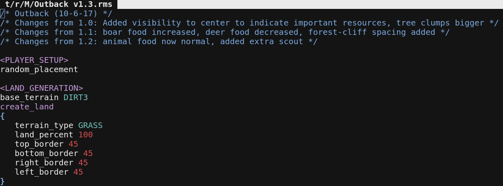

# vim-aoe2-rms

Syntax highlighting for AoE2 random map scripts in vim.

[Install](#install) - [License: GPL-3.0](#license)



## Install

Using vim-plug:

```vim
call plug#begin('~/.vim/plug')
Plug 'goto-bus-stop/vim-aoe2-rms'
call plug#end()
```

Other plugin managers should look similar.

## License

[GPL-3.0](./LICENSE.md)

Copyright (C) 2018  Renée Kooi <renee@kooi.me>

This program is free software: you can redistribute it and/or modify
it under the terms of the GNU General Public License as published by
the Free Software Foundation, either version 3 of the License, or
(at your option) any later version.

This program is distributed in the hope that it will be useful,
but WITHOUT ANY WARRANTY; without even the implied warranty of
MERCHANTABILITY or FITNESS FOR A PARTICULAR PURPOSE.  See the
GNU General Public License for more details.

You should have received a copy of the GNU General Public License
along with this program.  If not, see <https://www.gnu.org/licenses/>.
